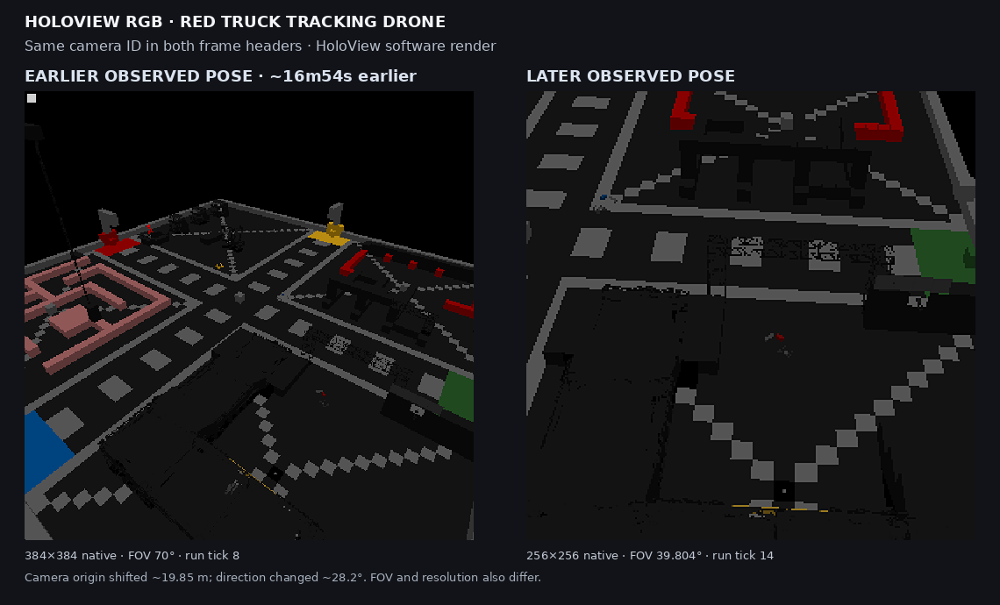
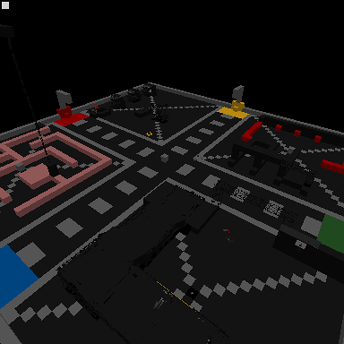
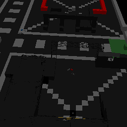

## Mission briefing

For a while, our test rig could find vehicles and draw their world around them,
but that did not answer the important question: could we observe a real vehicle
doing a real thing without borrowing a human at the keyboard?
The mission was simple: move one truck; keep the humans out of the driver’s
seat.

The latest disposable test world gave us a clean shot. We loaded the saved
recording, enabled the built-in Move block’s AI behavior, and let the game’s
Path Recorder take command for a bounded run. No custom wheel steering or
propulsion overrides were applied. Nobody reinvented the wheel, which was
fortunate: the vehicle already had four.

## Contact report: direct observations

- The run lasted 7,200 simulation ticks.
- The Move block’s AI behavior and autopilot were active during playback. Four
  wheels were present; wheel propulsion and steering overrides stayed at zero.
- The sampled waypoint sequence started at waypoint 9, reached waypoint 32,
  and wrapped back to waypoint 9 at tick 4,080. At the time limit it was on
  waypoint 28 of the next pass.
- The truck reached a maximum sampled displacement of 91.235 metres from its
  starting point and was 39.922 metres from that point when the bounded window
  ended.
- Four configured LCD camera feeds each left 13 time-stamped software-rendered
  frames in the disposable world copy. The camera view from the drone visibly
  changed between its first and last saved samples.

## What this means

We now have a working control case: Space Engineers’ own recorder and AI Move
behavior can move this truck through its saved route in our headless test
environment. That gives us something much better than “the markers look about
right” to compare against when we return to Voidwright.

The little cameras matter too. We can keep a sequence of rendered observations
with simulation tick and camera-pose metadata instead of treating a single
pretty picture as ground truth. It is a modest visual black box, but a black
box with timestamps is already a much better witness.

Command assessment: one truck moved, one waypoint loop wrapped, and four feeds
left receipts. Morale is high. Nobody is authorized to put “solved autonomous
navigation” on the poster.

## Side mission: overhead camera before and after

This figure is a separate V2R3 chamber capture, not footage from the R8 drive
above. HoloView’s software renderer exported two views attributed to the same
overhead drone about **16m54s apart**. Their recorded camera origins differ by
about **19.85 m**, and their forward directions by about **28.2°**.

The pair makes the camera/render pipeline’s output tangible: two pose-tagged
observations of the same disposable chamber. It is **not** a controlled
camera-motion trial. Resolution, field of view, render tick, and scene state
also differ, so image differences cannot be attributed to pose alone. These
are HoloView software renders—not native framebuffer captures or simulator
ground truth. The white corner marker is the renderer’s calibration marker,
not an in-world object.

Native-resolution frames are available separately; the comparison plate above
enlarges both with nearest-neighbor scaling for side-by-side inspection.

## Side mission: frame-linked scene metadata

A later, bounded V2R3 capture sampled the same HoloView camera at ticks 16, 136,
and 267. Each software-rendered frame now has a matching JSON sidecar keyed by
capture, camera, output, surface, and tick. It records HoloView's renderer-side
candidate grids and their world bounds: 13 grid candidates per frame, with the
candidate block count changing from 2,948 to 2,808 to 2,724. These are scene
metadata from the renderer—not pixel-derived detections, proof that every
candidate was visible, or simulator ground truth.

:::youtube tR0AT65-AZs "VRageCage D1V3R8 — First headless camera feed | HoloView software render"

## What we did *not* prove

This was **not** a Voidwright autonomous-navigation success. The game’s native
Move block and saved Path Recorder drove the vehicle; Voidwright did not choose
the route or command its wheels. Nor is this native GPU or framebuffer capture:
the LCD images came from a mod’s software renderer. The short bounded run
crossed a route loop, but it was not intended to qualify every obstacle,
vehicle configuration, or repeatability condition.

## Related research records

- [Multiview Cameras 001](../../labnotes/multiview-cameras-001/) documents the
  headless HoloView capture path and its renderer-side scene metadata. It is
  the formal record for the camera pipeline, not proof that the R8 truck was
  controlled by that apparatus.
- [Voxel Guidance 006](../../labnotes/voxel-guidance-006/) is a separate
  Blender-generated temporal-perception calibration. It explicitly did not
  test transfer to Space Engineers imagery, so it is context rather than
  evidence for this run.

## Next sortie

Use this recording as the baseline. Then hand one responsibility at a time to
Voidwright, keep the same observable telemetry, and compare the result against
the known route. If the truck takes a wrong turn, we want the receipt to tell us
which system had the wheel.
