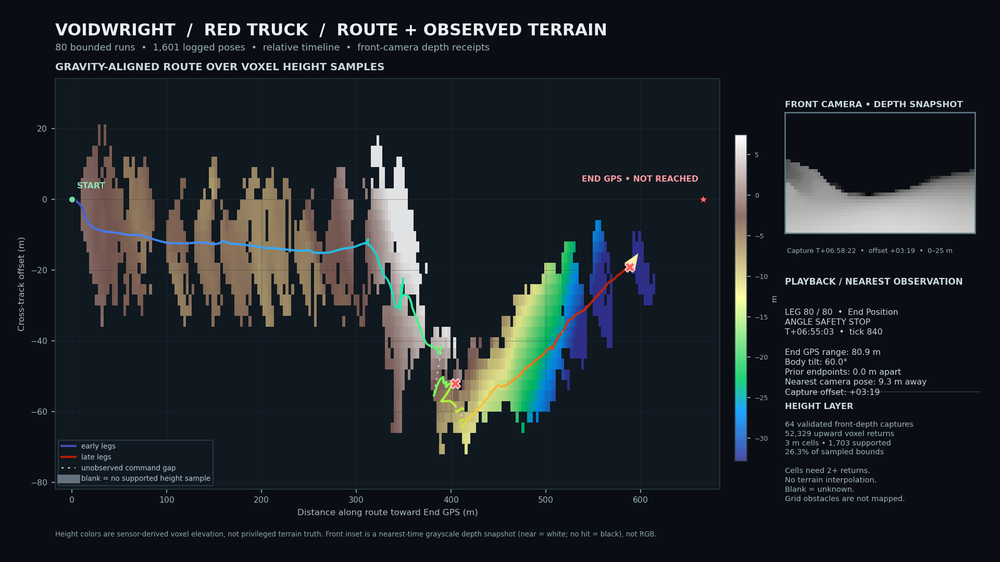

# Multiview Cameras 003: sparse terrain-height reconstruction over a stitched vehicle run

## Question

Can receipt-backed front-camera depth frames be registered against a long
Voidwright drive trace to make a useful terrain-height overlay, while leaving
unobserved areas visibly unknown and keeping a front-facing view in the frame?

## Method

This was a post-hoc analysis of the disposable V3 gravity fixture. The source
world was not started or changed for this rendering step. We combined 80
bounded Red Truck drive-to-coordinate operations, covering 2026-10-08
04:32–11:27 UTC, and 64 receipt-validated depth captures from the truck's front
camera (`109088616374925990`) on grid `138162475347618642`. The depth captures
span 04:35–11:30 UTC. They are observations from the same fixture and route
period, not images from a native framebuffer.

Each depth raster is 64×36 pixels, 120° horizontal FOV, and 25 m range. For
every non-miss pixel, its recorded camera basis and origin were used to
reconstruct a world-space ray hit. We retained hits attributed to
`MyVoxelPhysics` whose measured surface normal had dot product ≥0.75 with the
capture's local gravity-up direction. Points were projected into a
gravity-aligned route frame and reduced to the median height in 3 m cells. A
cell is shown only with at least two returns. There is no interpolation across
empty cells.

The drive telemetry is drawn over that static height layer. Solid segments
connect poses observed within a bounded command. Dotted segments mark only the
known displacement between commands; the motion through those gaps is
unknown. The small front-camera panel shows the nearest-in-time depth raster
snapshot, with its capture time offset shown explicitly. It is a grayscale
range image—not RGB, not a HoloView render, and not a native game screenshot.

## Results

The 80 operations contain 1,601 logged vehicle poses: 5 ended as `complete`,
72 timed out, and 3 stopped at the attitude safety limit. Within-command
logged travel sums to 703.55 m, and the final position is 590.34 m from the
initial position. The End GPS distance fell from 668.33 m to 80.90 m. The last
operation stopped at 60.0° body tilt; the End GPS was not reached. Eight
between-command endpoint gaps exceed 1 m; the largest is 18.19 m.

The sensor frames contain 58,794 voxel returns, of which 52,329 pass the
upward-facing-normal filter. The 3 m aggregation supports 1,703 of 6,464 cells
in the sampled bounds (26.3%); the remaining cells are deliberately blank.
Capture origins are near the logged route: in a spatial nearest-neighbor
comparison against the full pose trace, the worst camera-origin-to-route-pose
separation is 9.27 m. Displayed terrain heights are relative to the route's
gravity-up projection, not absolute planetary elevation. The display clips
its color scale to the 3rd–97th percentile of retained points.

## Figures and artifacts

The published video uses the same 80-run stitched route and sparse
sensor-derived height layer described here:

[Watch “Voidwright: Learning the Lay of the Land” on YouTube](https://youtu.be/c0LlEPDohoE).

[Open the full stitched route animation (MP4)](./assets/multiview-cameras-003/red-truck-heightmap-front-depth.mp4).

The renderer source and run receipts remain in the local working bundle for
now; the source-code and data bundle still needs to be staged before this
record can be called fully reproducible.

## Interpretation and limits

This is a positive result for a narrow integration capability: receipt-backed
front-depth samples can be registered alongside a long vehicle telemetry
trace and displayed as a sparse, gravity-aligned surface-height layer with an
honestly time-offset front-depth inset. It is a mixed result for the driving
task: substantial motion was recorded, but the route ended at its angle-safety
cutoff rather than at the End GPS.

The terrain layer was built after the drive. It was not supplied to the
controller and does not show that Voidwright used perception to navigate.
It is not a complete digital elevation model: the forward camera sees only
surfaces in its field of view and range, steep surfaces are suppressed by the
normal filter, and the grid-built course obstacles are not represented in
this voxel-only layer. A blank cell means “not sufficiently observed,” not
“flat” or “clear.” The between-command dotted lines are not recovered paths.

No native RGB/framebuffer footage was captured for this exact stitched run.
The inset is a single nearest-time ray-depth observation at each playback
position, not a continuous camera movie. The final summary's nearest capture
is 3m19s after the final logged pose; the offset is shown rather than hidden.

## Reproduction and provenance

The route selection is the 80-run set for controller `90164788286885540` in
fixture `bebd44898770362960c21201ebf851bf`, ending at the final
`attitude-limit` operation. The depth set is restricted to passing sensor
receipts for the same fixture, grid, and front camera, with capture times from
04:32 to 11:36 UTC. The renderer checks the receipt-recorded SHA-256 digests
for metadata, depth, entity IDs, and surface normals before using a frame.

The selected raw route receipts, sensor inputs, and renderer source remain
local and are not included in the public projection. The rendered summary
figure and video are the only explicit public media assets for this note.
